<!-- Los componentes visuales se generan con: python scripts/generate_assets.py -->

<picture>
  <source media="(prefers-color-scheme: dark)" srcset="assets/hero-es-dark.svg">
  
</picture>

  
  
  

  <b>🇪🇸 Español</b> · <a href="#-english-version">🇺🇸 English version</a>

---

Soy **Advanced QA Engineer** con más de 8 años asegurando la calidad de productos web, móviles, APIs y microservicios en **fintech, banca, CRM B2B, medios digitales y retail**.
Construyo frameworks de automatización desde cero con **Python + Pytest + Playwright**, **Cypress** y **Selenium**, integrados en **CI/CD** con enfoque **Shift-Left** y **Continuous Testing**.
Hoy mi diferencial es el **AI-Driven Testing**: diseño arquitecturas multiagente con **Claude**, con orquestador, subagentes especializados y agentes *judge* (LLM-as-a-Judge) que generan y evalúan código de prueba y documentación.

### 🤖 Así trabajo

<picture>
  <source media="(prefers-color-scheme: dark)" srcset="assets/terminal-dark.svg">
  
</picture>

### 📈 Impacto

<picture>
  <source media="(prefers-color-scheme: dark)" srcset="assets/impact-es-dark.svg">
  
</picture>

### 🛠️ Stack

<picture>
  <source media="(prefers-color-scheme: dark)" srcset="assets/stack-es-dark.svg">
  
</picture>

### 🧭 Trayectoria

<picture>
  <source media="(prefers-color-scheme: dark)" srcset="assets/timeline-es-dark.svg">
  
</picture>

### 🚀 Proyectos destacados

  <a href="https://github.com/DannyDan2016/cypress-automation-demoqa"><picture><source media="(prefers-color-scheme: dark)" srcset="assets/card-cypress-automation-demoqa-es-dark.svg"></picture></a>
  <a href="https://github.com/DannyDan2016/Test-frontend-QA-Cod"><picture><source media="(prefers-color-scheme: dark)" srcset="assets/card-test-frontend-qa-cod-es-dark.svg"></picture></a>
  <a href="https://github.com/DannyDan2016/Test-Backend-Cod"><picture><source media="(prefers-color-scheme: dark)" srcset="assets/card-test-backend-cod-es-dark.svg"></picture></a>

### 🐍 Actividad

<picture>
  <source media="(prefers-color-scheme: dark)" srcset="https://raw.githubusercontent.com/DannyDan2016/DannyDan2016/output/github-snake-dark.svg">
  
</picture>

---

<h2>🇺🇸 English version</h2>

<picture>
  <source media="(prefers-color-scheme: dark)" srcset="assets/hero-en-dark.svg">
  
</picture>

I'm an **Advanced QA Engineer** with 8+ years ensuring the quality of web, mobile, API and microservice products in **fintech, banking, B2B CRM, digital media and retail**.
I build test automation frameworks from scratch with **Python + Pytest + Playwright**, **Cypress** and **Selenium**, wired into **CI/CD** with a **Shift-Left** and **Continuous Testing** mindset.
My edge today is **AI-Driven Testing**: I design multi-agent architectures with **Claude**, using an orchestrator, specialized subagents and *judge* agents (LLM-as-a-Judge) that generate and review test code and documentation.

### 🤖 How I work

<picture>
  <source media="(prefers-color-scheme: dark)" srcset="assets/terminal-dark.svg">
  
</picture>

### 📈 Impact

<picture>
  <source media="(prefers-color-scheme: dark)" srcset="assets/impact-en-dark.svg">
  
</picture>

### 🛠️ Stack

<picture>
  <source media="(prefers-color-scheme: dark)" srcset="assets/stack-en-dark.svg">
  
</picture>

### 🧭 Career

<picture>
  <source media="(prefers-color-scheme: dark)" srcset="assets/timeline-en-dark.svg">
  
</picture>

### 🚀 Featured projects

  <a href="https://github.com/DannyDan2016/cypress-automation-demoqa"><picture><source media="(prefers-color-scheme: dark)" srcset="assets/card-cypress-automation-demoqa-en-dark.svg"></picture></a>
  <a href="https://github.com/DannyDan2016/Test-frontend-QA-Cod"><picture><source media="(prefers-color-scheme: dark)" srcset="assets/card-test-frontend-qa-cod-en-dark.svg"></picture></a>
  <a href="https://github.com/DannyDan2016/Test-Backend-Cod"><picture><source media="(prefers-color-scheme: dark)" srcset="assets/card-test-backend-cod-en-dark.svg"></picture></a>

Open to **QA Automation Engineer** and **Senior QA Engineer** roles, remote or hybrid. Let's talk on [LinkedIn](https://www.linkedin.com/in/danny-parrado-qa-engineer).

